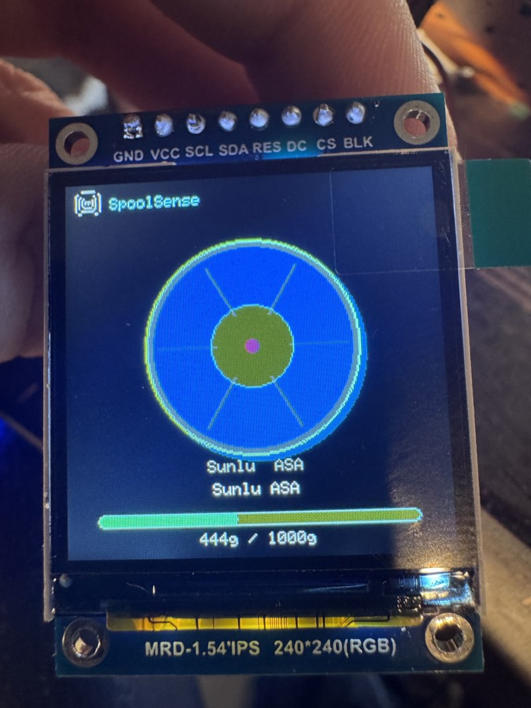

# Optional - TFT Display

A 240x240 color TFT replaces the 16x2 LCD with a graphical spool display showing filament color, weight bar, and tag format icons.

<figure markdown>
  { width="240" }
  <figcaption>Spool scanned on the 240x240 TFT — filament color, weight bar, and tag info</figcaption>
</figure>

!!! warning "Mutually exclusive with LCD"
    The TFT and LCD share GPIO 22/23 on WROOM. You can enable one or the other, not both.

## What You Need

- 1.54" ST7789 240x240 SPI TFT module (8-pin: GND, VCC, SCL, SDA, RES, DC, CS, BLK)
- 7 jumper wires (SCL, SDA, DC, CS, RES, VCC, GND) — 8 if wiring BLK for backlight control

## Wiring (ESP32-WROOM)

| TFT Pin | ESP32 Pin | Notes |
|---------|-----------|-------|
| GND | GND | |
| VCC | 3.3V | |
| SCL | GPIO 22 | SPI clock (shared with LCD SCL when LCD enabled) |
| SDA | GPIO 23 | SPI data / MOSI (shared with LCD SDA when LCD enabled) |
| RES | EN | Wired to ESP32 reset pin for reliable cold boot |
| DC | GPIO 4 | Data/command select (freed from LED when using TFT) |
| CS | GPIO 2 | Chip select |
| BLK | 3.3V | Backlight always on (or leave unconnected) |

!!! tip "RES pin"
    Wire the TFT's RES pin to the ESP32's **EN** pin. This ensures the display resets on every power cycle. Without this, the display may stay blank on cold boot (software reboot works fine either way).

!!! tip "LED pin"
    GPIO 4 is normally used for the status LED. When using the TFT, the LED is not needed since the display shows filament color directly. Disconnect the LED and use GPIO 4 for the TFT DC pin.

## Wiring (ESP32-S3-Zero + PN532)

!!! warning "PN532 only"
    On the S3-Zero, the TFT is only compatible with the PN532 NFC reader. The PN5180 uses too many of the limited header pins (GPIO 4-12), leaving insufficient free GPIOs for the TFT. The S3-Zero has GPIO 1-13 on side headers — GPIO 14+ are back pads that require soldering.

| TFT Pin | ESP32-S3 Pin | Notes |
|---------|-------------|-------|
| GND | GND | |
| VCC | 3.3V | |
| SCL | GPIO 12 | SPI clock |
| SDA | GPIO 13 | SPI data / MOSI |
| RES | GPIO 9 | Hardware reset (freed from PN5180 BUSY) |
| DC | GPIO 3 | Data/command select |
| CS | GPIO 10 | Chip select (freed from PN5180 GPIO) |
| BLK | 3.3V | Backlight always on |

!!! note "No external LED needed"
    The S3-Zero has an onboard WS2812 LED on GPIO 21 that still works alongside the TFT. The TFT also shows filament color directly.

## Wiring (ESP32-S3-DevKitC)

The S3-DevKitC runs the TFT on SPI3, completely separate from the PN5180 on SPI2. No bus contention — both can be PN5180 + TFT simultaneously.

| TFT Pin | ESP32-S3 Pin | Notes |
|---------|-------------|-------|
| GND | GND | |
| VCC | 3.3V | |
| SCL | GPIO 13 | SPI3 clock |
| SDA | GPIO 14 | SPI3 data / MOSI |
| RES | — | Not connected (software reset via LovyanGFX) |
| DC | GPIO 16 | Data/command select |
| CS | GPIO 15 | Chip select |
| BLK | 3.3V | Backlight always on |

!!! tip "Best board for TFT + PN5180"
    The S3-DevKitC is the only board with dedicated SPI buses for both the NFC reader and TFT display. No pin sharing, no compromises.

## What It Shows

- **Boot:** SpoolSense logo + firmware version
- **Ready:** Grey spool graphic with "Tap a spool to scan"
- **Spool scanned:** Color spool graphic with filament color fill, weight bar, brand and material name, tag format icon
- **Low spool:** Breathing/pulsing brightness when remaining weight is below 100g
- **Keypad entry:** Large tool number with confirm/cancel prompt
- **Write result:** Green checkmark or red X
- **WiFi/status:** Connection status during boot
- **AP mode:** Setup instructions with IP address

## Enable in Firmware

The TFT is enabled via the web config page (`/config` > Hardware > TFT Display toggle). No recompile needed.

Make sure the LCD toggle is **off** when enabling TFT on WROOM.

## Compatible Displays

| Display | Size | Resolution | Driver | Status |
|---------|------|-----------|--------|--------|
| [1.54" ST7789 Square](https://www.amazon.com/dp/B0DN9NMBFW) | 1.54" | 240x240 | ST7789 | Tested |
| 1.3" ST7789 Square | 1.3" | 240x240 | ST7789 | Should work (same driver) |
| [GC9A01 Round](https://www.amazon.com/dp/B0CLM3Y4KH) | 1.28" | 240x240 | GC9A01 | Supported — select in config page |

The firmware uses [LovyanGFX](https://github.com/lovyan03/LovyanGFX) which supports many SPI display drivers. Any 240x240 SPI TFT with a supported driver should work with a config change. If you try a display not listed here, let us know in [Discord](https://discord.gg/JYFQQQR5F).

!!! info "GC9A01 Round Display"
    The GC9A01 round TFT is supported as of v1.6.10. Select "GC9A01 round" in the TFT driver dropdown on the config page (`/config` > Hardware > TFT Driver). Same resolution and SPI wiring as the ST7789 — same pins, just a different driver selected at runtime.

## SPI Bus Note

- **ESP32-WROOM:** The TFT uses VSPI and the PN5180 uses HSPI — separate buses, no contention.
- **ESP32-S3-DevKitC:** The TFT uses SPI3 and the PN5180 uses SPI2 (FSPI) — fully dedicated buses.
- **ESP32-S3-Zero:** The TFT shares SPI pins with the PN5180, so TFT is only compatible with the PN532 reader on this board.
