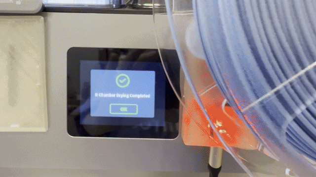

---
hide:
  - navigation
  - toc
---

<section class="home-hero">
  

    Open-source filament tracking
    <h1>Know what filament is loaded—without updating it by hand.</h1>
    
SpoolSense reads an NFC tag on your filament spool, identifies the material, and keeps your inventory or printer in sync.

    

      <a href="start-here/" class="button button--primary">Build your first scanner →</a>
      <a href="resources/compatibility/" class="button button--secondary">Check compatibility</a>
    

    
No cloud · No subscription · About $8–20 in hardware

  

  

    
  

</section>

<section class="home-section home-section--centered">
  How it works
  <h2>One scan, everything updated.</h2>
  

    
1<strong>Tag your spool</strong>Use an inexpensive NFC sticker.

    →
    
2<strong>Place it on the reader</strong>SpoolSense identifies it instantly.

    →
    
3<strong>Stay in sync</strong>Update inventory, dashboards, or your printer.

  

</section>

<section class="home-section">
  

    Start simple, add what you need
    <h2>A useful scanner on day one.</h2>
    
The ESP32 scanner works by itself. Integrations are optional upgrades, not prerequisites.

  

  

    <article class="benefit-card">
      ◎
      <h3>Identify every spool</h3>
      
See material, color, manufacturer, and remaining weight when a spool is scanned.

    </article>
    <article class="benefit-card">
      ↻
      <h3>Track your inventory</h3>
      
Connect Spoolman to register tags and keep remaining filament up to date.

    </article>
    <article class="benefit-card">
      ⌁
      <h3>Connect your printer</h3>
      
Add Klipper, AFC, toolchanger, Home Assistant, and slicer workflows when you're ready.

    </article>
  

</section>

<section class="starter-callout">
  

    Our recommended first build
    <h2>Skip the comparison charts for now.</h2>
    
Start with an ESP32-WROOM, PN5180 reader, and NTAG215 stickers. It is inexpensive, beginner-friendly, and leaves room for future add-ons.

  

  <a href="start-here/" class="button button--primary">See the beginner build →</a>
</section>

<section class="home-section home-section--centered home-community">
  <h2>Built in the open.</h2>
  
SpoolSense is GPL-3.0 licensed and developed by the 3D-printing community.

  

    <a href="https://github.com/SpoolSense" target="_blank" rel="noopener">View on GitHub ↗</a>
    <a href="https://discord.gg/pbXJhKpzd2" target="_blank" rel="noopener">Join Discord ↗</a>
  

</section>
